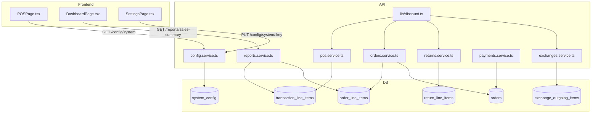

# Design Document — Discount Architecture

## Overview

This feature extends the bookstore ERP's discount model from a single `discount_pct`-only field to a full three-axis system: **type** (`Normal` / `Merchant` / `Special`), **mode** (`Percentage` / `Amount`), and **value** (numeric). The change is additive — existing columns and calculations are preserved — and is implemented through a shared utility module that all service layers import.

Key design goals:
- **Single source of truth for discount math** — a pure-function utility module (`apps/api/src/lib/discount.ts`) that all service modules import. No duplicated formulas.
- **No tax anywhere** — tax fields are left untouched; the grand total formula is `subtotal − discountTotal` throughout.
- **Non-destructive migration** — `ADD COLUMN IF NOT EXISTS` with safe defaults; existing rows are never rewritten.
- **Backward compatibility** — existing `discountPct`-only payloads continue to work; `discount_type` and `discount_mode` default to `'Normal'` and `'Percentage'` for legacy rows.

---

## Architecture



The `discount.ts` utility sits at the bottom of the dependency graph — it has no imports from other service modules, making it trivially testable as pure functions.

---

## Components and Interfaces

### 1. Shared Discount Utility (`apps/api/src/lib/discount.ts`)

Pure functions with no side effects. All service modules import from here.

```typescript
export type DiscountType = 'Normal' | 'Merchant' | 'Special';
export type DiscountMode = 'Percentage' | 'Amount';

export interface DiscountFields {
  discountType: DiscountType;
  discountMode: DiscountMode;
  discountPct: number;   // 0–100
  discountAmount: number; // absolute currency value, ≥ 0
}

export interface LineItemBase {
  unitPrice: number;
  quantity: number;
}

/**
 * Given a line item and a discount percentage, compute the discount amount.
 * discountAmount = round(unitPrice × quantity × (discountPct / 100), 2)
 */
export function computeAmountFromPct(item: LineItemBase, discountPct: number): number;

/**
 * Given a line item and a discount amount, compute the discount percentage.
 * discountPct = clamp(round((discountAmount / (unitPrice × quantity)) × 100, 4), 0, 100)
 * Returns 0 when unitPrice × quantity === 0.
 */
export function computePctFromAmount(item: LineItemBase, discountAmount: number): number;

/**
 * Resolve both discount fields from a mode + value pair.
 * Validates that discountAmount ≤ unitPrice × quantity.
 * Throws ValidationError if the constraint is violated.
 */
export function resolveDiscountFields(
  item: LineItemBase,
  mode: DiscountMode,
  value: number,
  type: DiscountType,
): DiscountFields;

/**
 * Validate a discount type string. Throws ValidationError for unknown values.
 */
export function validateDiscountType(value: unknown): DiscountType;

/**
 * Validate a discount mode string. Throws ValidationError for unknown values.
 */
export function validateDiscountMode(value: unknown): DiscountMode;

/**
 * Compute line total: unitPrice × quantity − discountAmount.
 */
export function computeLineTotal(item: LineItemBase, discountAmount: number): number;

/**
 * Cap enforcement: throws BusinessError('DISCOUNT_EXCEEDS_LIMIT') if
 * discountPct > maxPct.
 */
export function enforceDiscountCap(discountPct: number, maxPct: number): void;
```

### 2. Config Service Extensions (`apps/api/src/modules/config/config.service.ts`)

Three new entries added to `CONFIG_SCHEMA`:

```typescript
default_discount_type:  { type: 'string' },
default_discount_mode:  { type: 'string' },
default_discount_value: { type: 'number' },
```

Validation in `validateConfigValue` is extended to call `validateDiscountType` / `validateDiscountMode` from `discount.ts` when the key is one of the new discount keys, and to reject negative numbers for `default_discount_value`.

Three new typed helpers:

```typescript
export async function getDefaultDiscountType(branchId: number): Promise<DiscountType>;
export async function getDefaultDiscountMode(branchId: number): Promise<DiscountMode>;
export async function getDefaultDiscountValue(branchId: number): Promise<number>;
```

Each calls `getEffectiveConfig` so branch overrides take precedence. Fallbacks: `'Normal'`, `'Percentage'`, `0`.

### 3. Database Migration (`apps/api/src/db/migrations/1700000035_discount_architecture.cjs`)

```sql
-- Add columns to all four line item tables
ALTER TABLE transaction_line_items
  ADD COLUMN IF NOT EXISTS discount_type TEXT NOT NULL DEFAULT 'Normal'
    CHECK (discount_type IN ('Normal','Merchant','Special')),
  ADD COLUMN IF NOT EXISTS discount_mode TEXT NOT NULL DEFAULT 'Percentage'
    CHECK (discount_mode IN ('Percentage','Amount'));

ALTER TABLE order_line_items
  ADD COLUMN IF NOT EXISTS discount_type TEXT NOT NULL DEFAULT 'Normal'
    CHECK (discount_type IN ('Normal','Merchant','Special')),
  ADD COLUMN IF NOT EXISTS discount_mode TEXT NOT NULL DEFAULT 'Percentage'
    CHECK (discount_mode IN ('Percentage','Amount'));

ALTER TABLE return_line_items
  ADD COLUMN IF NOT EXISTS discount_type TEXT NOT NULL DEFAULT 'Normal'
    CHECK (discount_type IN ('Normal','Merchant','Special')),
  ADD COLUMN IF NOT EXISTS discount_mode TEXT NOT NULL DEFAULT 'Percentage'
    CHECK (discount_mode IN ('Percentage','Amount'));

ALTER TABLE exchange_outgoing_items
  ADD COLUMN IF NOT EXISTS discount_type TEXT NOT NULL DEFAULT 'Normal'
    CHECK (discount_type IN ('Normal','Merchant','Special')),
  ADD COLUMN IF NOT EXISTS discount_mode TEXT NOT NULL DEFAULT 'Percentage'
    CHECK (discount_mode IN ('Percentage','Amount'));

-- Add discount_total to orders header
ALTER TABLE orders
  ADD COLUMN IF NOT EXISTS discount_total NUMERIC(14,2) NOT NULL DEFAULT 0;

-- Seed default config keys (no-op if already present)
INSERT INTO system_config (key, value, updated_by, updated_at)
VALUES
  ('default_discount_type',  '"Normal"',     1, now()),
  ('default_discount_mode',  '"Percentage"', 1, now()),
  ('default_discount_value', '0',            1, now())
ON CONFLICT (key) DO NOTHING;
```

The `down` function drops the added columns and deletes the three config keys.

### 4. POS Service (`apps/api/src/modules/pos/pos.service.ts`)

**`LineItemInput` extended:**
```typescript
export interface LineItemInput {
  bookId: number;
  quantity: number;
  discountPct?: number;
  discountAmount?: number;   // new — takes precedence when mode is Amount
  discountType?: DiscountType; // new
  discountMode?: DiscountMode; // new
}
```

**`createTransaction` changes:**
1. After resolving `unitPrice`, call `getDefaultDiscountType`, `getDefaultDiscountMode`, `getDefaultDiscountValue` for the branch.
2. For each item, if `discountType`/`discountMode`/`discountAmount` are not provided, use the fetched defaults.
3. Call `resolveDiscountFields` from `discount.ts` to compute both `discountPct` and `discountAmount`.
4. Call `enforceDiscountCap` with the resolved `discountPct` and the role's `maxDiscPct`.
5. `lineTotal = computeLineTotal(item, discountAmount)` — no tax.
6. `grandTotal = subtotal` (subtotal is already post-discount; no tax added).
7. INSERT into `transaction_line_items` now includes `discount_type` and `discount_mode`.

**Tax removal:** The existing `taxRate` / `taxTotal` computation block is removed from `createTransaction`. `grandTotal = subtotal` (which equals `sum(lineTotal)`).

### 5. Orders Service (`apps/api/src/modules/orders/orders.service.ts`)

**`OrderLineInput` extended:**
```typescript
export interface OrderLineInput {
  bookId: number;
  quantity: number;
  discountAmount?: number;
  discountPct?: number;      // new
  discountType?: DiscountType; // new
  discountMode?: DiscountMode; // new
}
```

**`create` changes:**
1. Fetch default discount settings for the branch.
2. For each item, resolve discount fields using `resolveDiscountFields`.
3. `lineTotal = unitPrice × quantity − discountAmount` (no tax).
4. `total = sum(lineTotal)` — no tax component.
5. `discount_total = sum(discountAmount)` stored on the `orders` header.
6. INSERT into `order_line_items` includes `discount_type` and `discount_mode`.
7. INSERT into `orders` includes `discount_total`.

**`updateOrder` / line item updates:** Recalculate and UPDATE `discount_total` on the header whenever line items change.

### 6. Returns Service (`apps/api/src/modules/returns/returns.service.ts`)

**`createReturn` changes:**
1. After resolving the original `transaction_line_item`, read `discount_type` and `discount_mode` from the source line item (falling back to `'Normal'` / `'Percentage'` for legacy rows).
2. INSERT into `return_line_items` includes `discount_type` and `discount_mode`.
3. `lineRefundAmount` calculation is unchanged (uses existing `discount_pct`).

### 7. Exchanges Service (`apps/api/src/modules/exchanges/exchanges.service.ts`)

**`createExchange` / `settleExchange` changes:**
1. Fetch default discount settings for the branch.
2. For each outgoing item, if no explicit discount is provided, apply defaults via `resolveDiscountFields`.
3. INSERT into `exchange_outgoing_items` includes `discount_type` and `discount_mode`.

### 8. Payments Service (`apps/api/src/modules/payments/payments.service.ts`)

Only `getOrderBalance` is modified:

```typescript
// Before:
const orderTotal = parseFloat(rawTotal);
// ...
outstanding = orderTotal - totalPaid + totalRefunded

// After:
const orderTotal = parseFloat(rawTotal);
const discountTotal = parseFloat(orderRes.rows[0].discount_total ?? '0');
const netPayable = orderTotal - discountTotal;
// ...
outstanding = netPayable - totalPaid + totalRefunded
```

The response shape gains a `discountTotal` field:
```typescript
{
  orderTotal: number;
  discountTotal: number;
  netPayable: number;
  totalPaid: number;
  totalRefunded: number;
  outstanding: number;
  paymentStatus: string;
}
```

`computeOrderPaymentStatus` is updated to use `netPayable` instead of `orderTotal` when comparing against `totalPaid`.

### 9. Reports Service (`apps/api/src/modules/reports/reports.service.ts`)

**New `getSalesSummary` function** (or extension of `getSalesReport`):

```typescript
export interface SalesSummary {
  totalSales: number;
  totalDiscountAmount: number;
  discountByType: {
    Normal: number;
    Merchant: number;
    Special: number;
  };
}
```

SQL aggregation:
```sql
SELECT
  discount_type,
  COALESCE(SUM(discount_amount), 0) AS total
FROM transaction_line_items tli
JOIN transactions t ON t.id = tli.transaction_id
WHERE t.status = 'completed'
  -- optional branch/date filters
GROUP BY discount_type

UNION ALL

SELECT
  discount_type,
  COALESCE(SUM(discount_amount), 0) AS total
FROM order_line_items oli
JOIN orders o ON o.id = oli.order_id
WHERE o.status NOT IN ('Cancelled','CANCELLED')
  -- optional branch/date filters
GROUP BY discount_type
```

The existing `/api/reports/sales` endpoint response is extended with a `discountByType` field. A new `/api/reports/sales-summary` endpoint (or query parameter `?summary=true`) returns the condensed `SalesSummary` shape for the dashboard.

### 10. Frontend — POS Page (`apps/web/src/pages/POSPage.tsx`)

**`CartItem` interface extended:**
```typescript
interface CartItem {
  bookId: number;
  bookTitle: string;
  bookIsbn: string;
  quantity: number;
  unitPrice: number;
  discountType: DiscountType;  // new
  discountMode: DiscountMode;  // new
  discountPct: number;
  discountAmount: number;
  lineTotal: number;
}
```

**On mount:** Fetch `/api/config/system` (or the effective branch config endpoint) to read `default_discount_type`, `default_discount_mode`, `default_discount_value`. Store in component state.

**`addToCart`:** Initialise new items with the fetched defaults. Call `recalcItem` immediately.

**`recalcItem` updated:**
```typescript
function recalcItem(item: CartItem): CartItem {
  const lineCents = Math.round(item.unitPrice * 100) * item.quantity;
  let discountAmtCents: number;
  let discountPct: number;

  if (item.discountMode === 'Percentage') {
    discountAmtCents = Math.round(lineCents * (item.discountPct / 100));
    discountPct = item.discountPct;
  } else {
    discountAmtCents = Math.round(item.discountAmount * 100);
    discountPct = lineCents > 0
      ? Math.min(100, (discountAmtCents / lineCents) * 100)
      : 0;
  }

  const lineTotalCents = lineCents - discountAmtCents;
  return {
    ...item,
    discountPct,
    discountAmount: discountAmtCents / 100,
    lineTotal: lineTotalCents / 100,
  };
}
```

**`calcCart` updated:** Remove tax calculation. `grandTotal = subtotal − discountTotal`.

**Cart item UI:** Each cart item row gains:
- A dropdown for `discountType` (`Normal` / `Merchant` / `Special`)
- A toggle for `discountMode` (`%` / `ETB`)
- The existing discount value input (label changes based on mode)

**Payload to API:** `items` array now includes `discountType`, `discountMode`, `discountPct`, `discountAmount` per item.

### 11. Frontend — Settings Page (`apps/web/src/pages/SettingsPage.tsx`)

Three new entries added to `CONFIG_META`:

```typescript
default_discount_type:  {
  label: 'Default Discount Type',
  tab: 'Discounts',
  type: 'string',
  description: 'Default type applied to new line items: Normal, Merchant, or Special',
},
default_discount_mode:  {
  label: 'Default Discount Mode',
  tab: 'Discounts',
  type: 'string',
  description: 'Default entry mode: Percentage or Amount',
},
default_discount_value: {
  label: 'Default Discount Value',
  tab: 'Discounts',
  type: 'number',
  description: 'Default discount value (percentage or amount depending on mode)',
},
```

The existing `ConfigRowItem` component renders `string` type keys as text inputs. For `default_discount_type` and `default_discount_mode`, the component is extended to render a `<select>` when the key is one of the known enum keys (detected by key name). This avoids adding a new `type: 'enum'` to the schema.

### 12. Frontend — Dashboard Page (`apps/web/src/pages/DashboardPage.tsx`)

A new `SalesSummary` interface is added:
```typescript
interface SalesSummary {
  totalSales: number;
  totalDiscountAmount: number;
  discountByType: { Normal: number; Merchant: number; Special: number };
}
```

A new `useQuery` fetches `/api/reports/sales-summary` (with the same date/branch filters as other reports).

A new "Discounts" `Section` is added to the dashboard layout, containing:
- A `KpiCard` for total discount amount
- Three `KpiCard` components for `Normal`, `Merchant`, and `Special` discount totals

These use the existing `KpiCard` and `Section` components already present on the page.

---

## Data Models

### `transaction_line_items` (extended)

| Column | Type | Default | Notes |
|--------|------|---------|-------|
| `discount_type` | `TEXT NOT NULL` | `'Normal'` | CHECK IN ('Normal','Merchant','Special') |
| `discount_mode` | `TEXT NOT NULL` | `'Percentage'` | CHECK IN ('Percentage','Amount') |

Existing columns `discount_pct` and `discount_amount` are unchanged.

### `order_line_items` (extended)

Same two columns as above.

### `return_line_items` (extended)

Same two columns as above.

### `exchange_outgoing_items` (extended)

Same two columns as above.

### `orders` (extended)

| Column | Type | Default | Notes |
|--------|------|---------|-------|
| `discount_total` | `NUMERIC(14,2) NOT NULL` | `0` | Sum of all line item discount_amount values |

### `system_config` (seeded)

| Key | Default Value |
|-----|---------------|
| `default_discount_type` | `"Normal"` |
| `default_discount_mode` | `"Percentage"` |
| `default_discount_value` | `0` |

---

## Correctness Properties

*A property is a characteristic or behavior that should hold true across all valid executions of a system — essentially, a formal statement about what the system should do. Properties serve as the bridge between human-readable specifications and machine-verifiable correctness guarantees.*

### Property 1: Discount type validation rejects all non-enum strings

*For any* string value that is not one of `['Normal', 'Merchant', 'Special']`, calling `validateDiscountType` (or writing `default_discount_type` via the Config_Service) SHALL throw a `ValidationError`.

**Validates: Requirements 1.2**

---

### Property 2: Discount mode validation rejects all non-enum strings

*For any* string value that is not one of `['Percentage', 'Amount']`, calling `validateDiscountMode` (or writing `default_discount_mode` via the Config_Service) SHALL throw a `ValidationError`.

**Validates: Requirements 1.3**

---

### Property 3: Negative discount value is always rejected

*For any* numeric value less than 0, writing `default_discount_value` via the Config_Service SHALL throw a `ValidationError`.

**Validates: Requirements 1.4**

---

### Property 4: Percentage-mode discount amount round-trip

*For any* line item with `unitPrice ≥ 0`, `quantity ≥ 1`, and `discountPct ∈ [0, 100]`, the computed `discountAmount = round(unitPrice × quantity × (discountPct / 100), 2)` SHALL satisfy `|discountAmount - unitPrice × quantity × (discountPct / 100)| ≤ 0.01`.

This is the core round-trip property: entering a percentage and reading back the amount should be consistent within rounding tolerance.

**Validates: Requirements 7.1, 7.6**

---

### Property 5: Amount-mode discount percentage round-trip

*For any* line item with `unitPrice > 0`, `quantity ≥ 1`, and `discountAmount ∈ [0, unitPrice × quantity]`, the computed `discountPct = clamp(round((discountAmount / (unitPrice × quantity)) × 100, 4), 0, 100)` SHALL satisfy `|computeAmountFromPct(item, discountPct) - discountAmount| ≤ 0.01`.

**Validates: Requirements 7.2, 7.6**

---

### Property 6: Discount amount never exceeds line value

*For any* line item, `discountAmount ≤ unitPrice × quantity`. Any request where this constraint is violated SHALL be rejected with a `ValidationError`.

**Validates: Requirements 7.4**

---

### Property 7: Grand total formula (no tax)

*For any* cart or order with one or more line items, `grandTotal = sum(unitPrice_i × quantity_i − discountAmount_i)` for all items `i`. No tax component is added.

**Validates: Requirements 3.6, 4.6**

---

### Property 8: Discount cap enforcement

*For any* staff role with a configured `max_line_discount_pct` and *for any* discount percentage exceeding that cap, the Discount_Engine SHALL reject the request with `BusinessError('DISCOUNT_EXCEEDS_LIMIT')`.

**Validates: Requirements 6.7, 11.7**

---

### Property 9: Outstanding balance uses net payable

*For any* order with `total`, `discount_total`, and `total_paid`, the `outstanding` balance returned by `getOrderBalance` SHALL equal `max(0, total − discount_total − total_paid + total_refunded)`.

**Validates: Requirements 10.1, 10.3**

---

### Property 10: Discount aggregation by type

*For any* set of line items with known `discount_type` and `discount_amount` values, `getSalesSummary` SHALL return `discountByType.Normal = sum(discount_amount WHERE discount_type = 'Normal')`, and equivalently for `Merchant` and `Special`.

**Validates: Requirements 8.6, 9.5**

---

## Error Handling

| Error Code | Type | Trigger | HTTP Status |
|------------|------|---------|-------------|
| `DISCOUNT_EXCEEDS_LIMIT` | `BusinessError` | `discountPct > max_line_discount_pct` for role | 422 |
| `DISCOUNT_AMOUNT_EXCEEDS_LINE` | `ValidationError` | `discountAmount > unitPrice × quantity` | 400 |
| `INVALID_DISCOUNT_TYPE` | `ValidationError` | `discount_type` not in allowed set | 400 |
| `INVALID_DISCOUNT_MODE` | `ValidationError` | `discount_mode` not in allowed set | 400 |
| `INVALID_DISCOUNT_VALUE` | `ValidationError` | `default_discount_value < 0` or non-numeric | 400 |

All errors are returned through the existing `errorHandler` middleware and follow the existing `{ error: string; code?: string; details?: unknown }` response shape.

**Backward compatibility:** If a request omits `discountType` or `discountMode`, the system defaults to `'Normal'` and `'Percentage'` respectively. If a request provides only `discountPct` (legacy format), `discountAmount` is computed automatically. If a request provides only `discountAmount` (legacy orders format), `discountPct` is computed automatically.

---

## Testing Strategy

### Unit Tests

Unit tests cover specific examples, edge cases, and error conditions:

- `discount.ts` pure functions: `computeAmountFromPct`, `computePctFromAmount`, `resolveDiscountFields`, `enforceDiscountCap` with concrete inputs including zero-price edge cases.
- Config service: `getDefaultDiscountType`, `getDefaultDiscountMode`, `getDefaultDiscountValue` with and without the keys present in the DB.
- Config validation: writing invalid values for each new key.
- Payments service: `getOrderBalance` with a non-zero `discount_total`.
- Reports service: `getSalesSummary` with a known set of line items.

### Property-Based Tests

Property-based tests use [fast-check](https://github.com/dubzzz/fast-check) (already available in the Node.js ecosystem) with a minimum of **100 iterations per property**.

Each property test is tagged with a comment referencing the design property:
```typescript
// Feature: discount-architecture, Property 4: Percentage-mode discount amount round-trip
```

**Properties to implement as PBT:**

| Property | Generator | Assertion |
|----------|-----------|-----------|
| P1: Type validation | `fc.string()` filtered to exclude valid values | `validateDiscountType` throws |
| P2: Mode validation | `fc.string()` filtered to exclude valid values | `validateDiscountMode` throws |
| P3: Negative value rejection | `fc.float({ max: -0.01 })` | Config write throws |
| P4: Pct→Amount round-trip | `fc.record({ unitPrice: fc.float({min:0.01,max:9999}), quantity: fc.integer({min:1,max:100}), discountPct: fc.float({min:0,max:100}) })` | `|computeAmountFromPct - expected| ≤ 0.01` |
| P5: Amount→Pct round-trip | Same record, `discountAmount` derived from `unitPrice × quantity × random` | `|computeAmountFromPct(item, computePctFromAmount(item, amt)) - amt| ≤ 0.01` |
| P6: Amount cap | `discountAmount > unitPrice × quantity` | `resolveDiscountFields` throws |
| P7: Grand total formula | Random cart items | `grandTotal = sum(lineTotal)` |
| P8: Discount cap | `discountPct > maxPct` | `enforceDiscountCap` throws |
| P9: Outstanding balance | Random `total`, `discountTotal`, `totalPaid` | `outstanding = max(0, total - discountTotal - totalPaid)` |
| P10: Discount aggregation | Random line items with known types and amounts | `discountByType` sums match manual aggregation |

### Integration Tests

Integration tests (using the existing `testDb` helper) cover:

- Migration: columns exist on all four tables after migration runs; migration is idempotent.
- POS transaction creation: `discount_type` and `discount_mode` are persisted on `transaction_line_items`.
- Order creation: `discount_total` is stored on the `orders` header.
- Payments balance: `getOrderBalance` returns correct `outstanding` when `discount_total > 0`.
- Reports: `getSalesSummary` returns correct `discountByType` breakdown.

### Smoke Tests

- Migration idempotency: running the migration twice does not fail.
- Config seed: the three new keys exist in `system_config` after migration.
