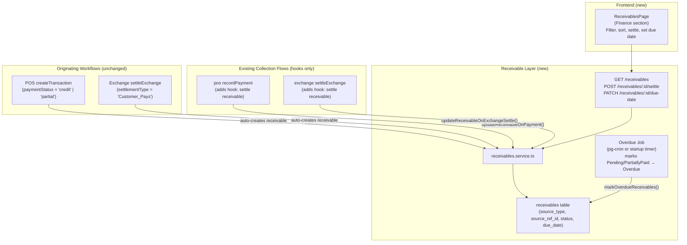
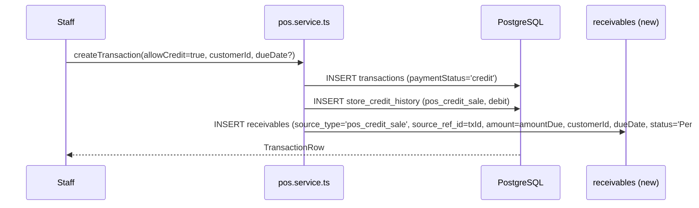
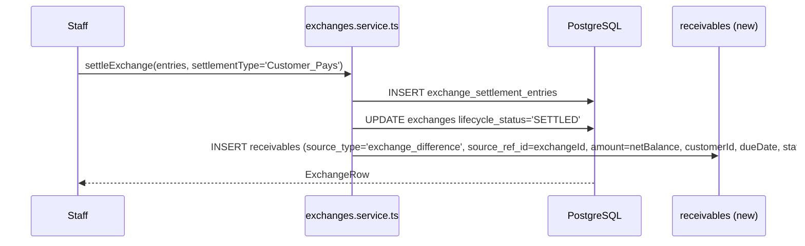
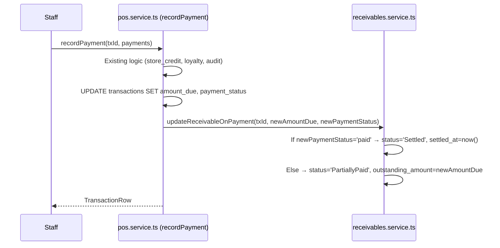
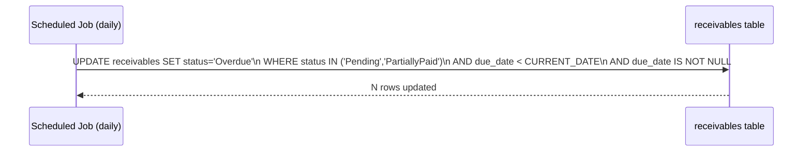
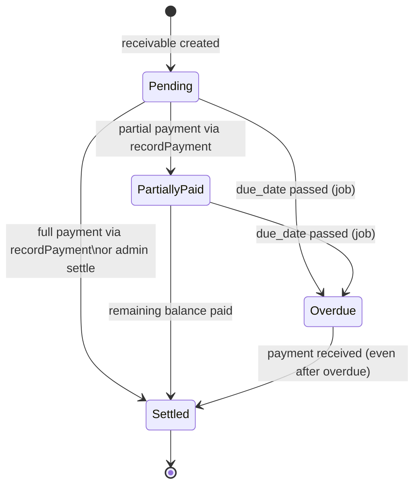

# Design Document: Receivable Settlement Management

## Overview

This feature introduces a unified `receivables` table as the single source of truth for all customer debt tracking in the bookstore ERP. It aggregates outstanding balances from two distinct originating workflows — Credit POS Sales and Exchange Difference (Customer_Pays) settlements — without altering any existing business logic in those workflows. The receivable is a **record of the debt**, not a payment mechanism. Existing collection flows (`recordPayment` in POS, `settleExchange` in Exchanges) continue to operate unchanged; they gain only a lightweight hook that updates the receivable record when a debt is fully or partially paid.

The implementation is intentionally additive. Every change lands in new tables, a new API module, and new frontend components. Nothing is removed or rewritten. Legacy `store_credit_history` entries for `pos_credit_sale`/`pos_credit_settlement` are preserved and remain the store-credit balance ledger; the new receivables table tracks the settlement lifecycle independently.

---

## Architecture



---

## Sequence Diagrams

### Credit POS Sale → Receivable Creation



### Exchange Customer_Pays → Receivable Creation



### Receivable Settlement via recordPayment



### Overdue Background Job



---

## Components and Interfaces

### Component 1: `receivables` Database Table

**Purpose**: Single source of truth for all customer receivables across POS credit sales and exchange differences.

**Interface** (schema):
```typescript
interface Receivable {
  id: bigint;                   // PK
  source_type: 'pos_credit_sale' | 'exchange_difference';
  source_ref_id: string;        // transaction_number (POS) or exchange_reference (Exchange)
  source_entity_id: bigint;     // transactions.id or exchanges.id (FK, for joins)
  customer_id: number;          // NOT NULL — receivables always have a customer
  branch_id: number;            // branch context
  original_amount: number;      // amount at creation time (NUMERIC 14,2)
  outstanding_amount: number;   // current unpaid amount (decremented on payment)
  currency: string;             // 'ETB'
  due_date: Date | null;        // nullable; set at creation or updated via PATCH
  settlement_date: Date | null; // populated when status becomes 'Settled'
  status: 'Pending' | 'PartiallyPaid' | 'Settled' | 'Overdue';
  notes: string | null;
  created_at: Date;
  updated_at: Date;
}
```

**Validation Rules**:
- `customer_id` is NOT NULL (receivables without a customer are not supported)
- `original_amount > 0`
- `outstanding_amount >= 0`
- `status` is a constrained ENUM
- `source_ref_id` + `source_type` pair is UNIQUE (prevents duplicate receivables per transaction/exchange)

---

### Component 2: `receivables.service.ts`

**Purpose**: All business logic for creating, querying, and updating receivables. No other module touches the `receivables` table directly.

**Interface**:
```typescript
interface ReceivableRow {
  id: string;
  sourceType: 'pos_credit_sale' | 'exchange_difference';
  sourceRefId: string;
  sourceEntityId: string;
  customerId: number;
  customerName: string | null;
  customerCode: string | null;
  branchId: number;
  originalAmount: number;
  outstandingAmount: number;
  currency: string;
  dueDate: string | null;         // ISO date string
  settlementDate: string | null;
  status: 'Pending' | 'PartiallyPaid' | 'Settled' | 'Overdue';
  notes: string | null;
  createdAt: string;
  updatedAt: string;
}

// Create — called from POS and Exchange service hooks
function createReceivable(data: {
  sourceType: 'pos_credit_sale' | 'exchange_difference';
  sourceRefId: string;
  sourceEntityId: number;
  customerId: number;
  branchId: number;
  originalAmount: number;
  dueDate?: string | null;
  notes?: string;
}, client: PoolClient): Promise<ReceivableRow>

// Query — used by the API layer
function list(opts: {
  branchId?: number;
  customerId?: number;
  status?: string;
  sourceType?: string;
  dueDateFrom?: string;
  dueDateTo?: string;
  overdueOnly?: boolean;
  page?: number;
  pageSize?: number;
}): Promise<{ items: ReceivableRow[]; total: number; page: number; totalPages: number }>

// Settlement hook — called from pos.recordPayment and exchanges.settleExchange
function updateReceivableOnPayment(opts: {
  sourceType: 'pos_credit_sale' | 'exchange_difference';
  sourceEntityId: number;
  newOutstandingAmount: number;
  isFullySettled: boolean;
}, client: PoolClient): Promise<void>

// Due-date update — called from PATCH /receivables/:id/due-date
function updateDueDate(id: string, dueDate: string | null, staffCtx: StaffCtx): Promise<ReceivableRow>

// Overdue job — called on a schedule (or lazy on-read fallback)
function markOverdueReceivables(): Promise<number>  // returns rows updated
```

---

### Component 3: `receivables.routes.ts`

**Purpose**: HTTP interface to the receivables service. Lives under `/api/receivables`.

**Interface**:
```typescript
// List receivables (with filtering)
GET /receivables
  Query: branchId?, customerId?, status?, sourceType?, dueDateFrom?, dueDateTo?, overdueOnly?, page?, pageSize?
  Auth: PROCESS_PAYMENT | VIEW_REPORTS
  Response: { items: ReceivableRow[]; total: number; page: number; totalPages: number }

// Get single receivable
GET /receivables/:id
  Auth: PROCESS_PAYMENT | VIEW_REPORTS
  Response: ReceivableRow

// Manual settle — records the settlement (does NOT collect payment; links to existing payment flow)
POST /receivables/:id/settle
  Body: { notes?: string }
  Auth: PROCESS_PAYMENT
  Response: ReceivableRow
  Note: This is for manual write-off / admin override. Normal settlement happens through
        pos.recordPayment and exchanges.settleExchange.

// Update due date
PATCH /receivables/:id/due-date
  Body: { dueDate: string | null }
  Auth: PROCESS_PAYMENT
  Response: ReceivableRow
```

**Responsibilities**:
- Auth guard via existing `requirePermission` middleware
- Input validation (date format, ID parsing)
- Delegation to `receivables.service.ts`

---

### Component 4: Migration `1700000036_create_receivables.cjs`

**Purpose**: Additive schema change — creates the `receivables` table and necessary indexes. Does not alter any existing table.

```sql
CREATE TABLE receivables (
  id                BIGSERIAL PRIMARY KEY,
  source_type       TEXT NOT NULL
                      CHECK (source_type IN ('pos_credit_sale', 'exchange_difference')),
  source_ref_id     TEXT NOT NULL,        -- transaction_number or exchange_reference
  source_entity_id  BIGINT NOT NULL,      -- transactions.id or exchanges.id (no FK constraint — cross-table)
  customer_id       INTEGER NOT NULL REFERENCES customers(id),
  branch_id         INTEGER NOT NULL REFERENCES branches(id),
  original_amount   NUMERIC(14,2) NOT NULL CHECK (original_amount > 0),
  outstanding_amount NUMERIC(14,2) NOT NULL CHECK (outstanding_amount >= 0),
  currency          TEXT NOT NULL DEFAULT 'ETB',
  due_date          DATE,
  settlement_date   TIMESTAMPTZ,
  status            TEXT NOT NULL DEFAULT 'Pending'
                      CHECK (status IN ('Pending', 'PartiallyPaid', 'Settled', 'Overdue')),
  notes             TEXT,
  created_at        TIMESTAMPTZ NOT NULL DEFAULT now(),
  updated_at        TIMESTAMPTZ NOT NULL DEFAULT now(),
  CONSTRAINT receivables_source_unique UNIQUE (source_type, source_entity_id)
);

CREATE INDEX ON receivables (customer_id);
CREATE INDEX ON receivables (branch_id, status);
CREATE INDEX ON receivables (due_date) WHERE due_date IS NOT NULL AND status IN ('Pending', 'PartiallyPaid');
CREATE INDEX ON receivables (source_type, source_entity_id);
CREATE INDEX ON receivables (created_at DESC);
```

> **Note on `source_entity_id`**: A BIGINT column without a foreign key constraint is used (rather than two nullable FK columns) to keep the schema simple and avoid cross-table FK maintenance. The `source_type` field tells you which table to join against when needed.

---

### Component 5: `ReceivablesPage.tsx` (Frontend)

**Purpose**: New page in the Finance section showing all customer receivables with filtering, sorting, due-date management, and settlement actions.

**Interface**:
```typescript
interface ReceivablesPageProps {
  userRole?: string;
  userPermissions?: string[];
}
```

**Responsibilities**:
- Fetch receivables via `GET /receivables` (TanStack Query)
- Filter controls: status, source type, customer, date range, overdue toggle
- Table columns: Customer, Type, Reference, Original Amount, Outstanding, Due Date, Status, Actions
- Actions per row:
  - Edit Due Date (inline date picker — PATCH `/receivables/:id/due-date`)
  - Settle (admin override — POST `/receivables/:id/settle`) — guarded by `PROCESS_PAYMENT`
  - View Source (navigates to POS transaction or Exchange)
- Summary cards: Total Outstanding, Overdue Count, Pending Count, Settled This Month
- Status badge color map: Pending=blue, PartiallyPaid=yellow, Settled=green, Overdue=red

---

## Data Models

### Receivable Status Lifecycle



### Receivable Row (TypeScript)

```typescript
type ReceivableStatus = 'Pending' | 'PartiallyPaid' | 'Settled' | 'Overdue';
type ReceivableSourceType = 'pos_credit_sale' | 'exchange_difference';

interface ReceivableRow {
  id: string;
  sourceType: ReceivableSourceType;
  sourceRefId: string;          // human-readable ref: POS-20240101-0001 or EXC-20240101-0001
  sourceEntityId: string;       // numeric DB id as string
  customerId: number;
  customerName: string | null;
  customerCode: string | null;
  branchId: number;
  originalAmount: number;
  outstandingAmount: number;
  currency: string;
  dueDate: string | null;       // YYYY-MM-DD
  settlementDate: string | null;
  status: ReceivableStatus;
  notes: string | null;
  createdAt: string;
  updatedAt: string;
}
```

---

## Key Functions with Formal Specifications

### Function 1: `createReceivable()`

```typescript
function createReceivable(
  data: CreateReceivableInput,
  client: PoolClient
): Promise<ReceivableRow>
```

**Preconditions:**
- `data.customerId` is a valid, active customer in the database
- `data.originalAmount > 0`
- No receivable with the same `(source_type, source_entity_id)` already exists
- `client` is an open transaction (called within `BEGIN`/`COMMIT` of parent flow)

**Postconditions:**
- A new row is inserted in `receivables` with `status = 'Pending'`
- `outstanding_amount` equals `original_amount` at creation
- Returns the created `ReceivableRow`
- On duplicate `(source_type, source_entity_id)`, an existing row is returned (idempotent via `ON CONFLICT DO NOTHING ... RETURNING`)

**Invariants:**
- Must be called within the same DB transaction as the originating POS or Exchange insert
- If the parent transaction rolls back, the receivable row also rolls back (atomicity)

---

### Function 2: `updateReceivableOnPayment()`

```typescript
function updateReceivableOnPayment(opts: {
  sourceType: ReceivableSourceType;
  sourceEntityId: number;
  newOutstandingAmount: number;
  isFullySettled: boolean;
}, client: PoolClient): Promise<void>
```

**Preconditions:**
- A receivable with matching `(source_type, source_entity_id)` exists
- `newOutstandingAmount >= 0`
- `client` is an open transaction (called within the payment's `BEGIN`/`COMMIT`)

**Postconditions:**
- If `isFullySettled`: `status = 'Settled'`, `settlement_date = now()`, `outstanding_amount = 0`
- If not fully settled: `status = 'PartiallyPaid'`, `outstanding_amount = newOutstandingAmount`
- If receivable is already `'Settled'`, the function is a no-op (idempotent)
- `updated_at` is refreshed in both cases

**Loop Invariants:** N/A (no loops)

---

### Function 3: `markOverdueReceivables()`

```typescript
function markOverdueReceivables(): Promise<number>
```

**Preconditions:**
- Callable at any time (designed for daily scheduled execution)

**Postconditions:**
- All `receivables` rows where `status IN ('Pending', 'PartiallyPaid')` AND `due_date < CURRENT_DATE` AND `due_date IS NOT NULL` have their `status` set to `'Overdue'`
- Returns the count of rows updated
- Rows with `due_date IS NULL` are never marked overdue
- Already-`'Settled'` rows are never touched

**Algorithm:**
```sql
UPDATE receivables
SET status = 'Overdue', updated_at = now()
WHERE status IN ('Pending', 'PartiallyPaid')
  AND due_date IS NOT NULL
  AND due_date < CURRENT_DATE
RETURNING id
```

---

### Function 4: `updateDueDate()`

```typescript
function updateDueDate(
  id: string,
  dueDate: string | null,
  staffCtx: StaffCtx
): Promise<ReceivableRow>
```

**Preconditions:**
- Receivable with `id` exists
- Receivable status is NOT `'Settled'`
- `dueDate` is either `null` or a valid ISO date string (`YYYY-MM-DD`)

**Postconditions:**
- `due_date` is updated to the provided value (or cleared if `null`)
- If new `dueDate` is in the past and status was `'Overdue'`, status remains `'Overdue'`
- If new `dueDate` is in the future and status was `'Overdue'`, status is reset to `'Pending'` or `'PartiallyPaid'` based on `outstanding_amount`
- An audit log entry is inserted
- Returns updated `ReceivableRow`

---

## Algorithmic Pseudocode

### POS Credit Sale Hook (inside `createTransaction`)

```pascal
ALGORITHM handleCreditSaleReceivable(client, customerId, txId, transactionNumber, amountDue, dueDate, branchId)
INPUT: client (DB transaction), customerId, txId, transactionNumber, amountDue, dueDate, branchId
OUTPUT: void (side effect: receivable row created)

BEGIN
  IF amountDue > 0.01 AND customerId IS NOT NULL THEN
    
    // Ensure store_credit_accounts row exists (existing logic — unchanged)
    INSERT INTO store_credit_accounts (customer_id, balance)
    VALUES (customerId, 0)
    ON CONFLICT (customer_id) DO NOTHING
    
    // Existing store_credit_history entry (unchanged)
    INSERT INTO store_credit_history (customer_id, ref_type, ref_id, amount, direction)
    VALUES (customerId, 'pos_credit_sale', transactionNumber, amountDue, 'debit')
    
    // NEW: Create receivable
    CALL createReceivable(client, {
      sourceType: 'pos_credit_sale',
      sourceRefId: transactionNumber,
      sourceEntityId: txId,
      customerId,
      branchId,
      originalAmount: amountDue,
      dueDate: dueDate
    })
    
  END IF
END
```

### Exchange Customer_Pays Hook (inside `settleExchange`)

```pascal
ALGORITHM handleExchangeReceivable(client, exchange, staffCtx, dueDate)
INPUT: client (DB transaction), exchange (ExchangeRow), staffCtx, dueDate
OUTPUT: void (side effect: receivable row created)

BEGIN
  IF exchange.settlementType = 'Customer_Pays' AND exchange.netBalance > 0.01 THEN
    IF exchange.customerId IS NOT NULL THEN
      
      CALL createReceivable(client, {
        sourceType: 'exchange_difference',
        sourceRefId: exchange.exchangeReference,
        sourceEntityId: exchange.id,
        customerId: exchange.customerId,
        branchId: exchange.branchId,
        originalAmount: exchange.netBalance,
        dueDate: dueDate
      })
      
    END IF
  END IF
END
```

### Settlement Update Hook (inside `recordPayment`)

```pascal
ALGORITHM updateReceivableAfterPayment(client, tx, newAmountDue, newPaymentStatus)
INPUT: client (DB transaction), tx (TransactionRow), newAmountDue, newPaymentStatus
OUTPUT: void

BEGIN
  isFullySettled ← (newPaymentStatus = 'paid')
  
  CALL updateReceivableOnPayment(client, {
    sourceType: 'pos_credit_sale',
    sourceEntityId: tx.id,
    newOutstandingAmount: newAmountDue,
    isFullySettled
  })
  
  // No error thrown if receivable not found (legacy transactions pre-migration won't have one)
END
```

---

## Error Handling

### Error Scenario 1: Duplicate Receivable Creation

**Condition**: `createReceivable` is called for a `(source_type, source_entity_id)` pair that already has a receivable (e.g., retry of a failed transaction).

**Response**: `INSERT ... ON CONFLICT (source_type, source_entity_id) DO NOTHING` — the insert is silently skipped. The function queries back the existing row and returns it.

**Recovery**: Parent transaction proceeds normally. No error is surfaced.

---

### Error Scenario 2: Payment Hook Fails (No Receivable Found)

**Condition**: `updateReceivableOnPayment` is called for a transaction that predates the migration (no receivable row exists).

**Response**: The UPDATE affects 0 rows. The function logs a warning but does not throw.

**Recovery**: The payment completes successfully. The receivable simply doesn't exist for that legacy transaction. No data corruption.

---

### Error Scenario 3: Setting Due Date on Settled Receivable

**Condition**: Staff attempts to `PATCH /receivables/:id/due-date` on a receivable with `status = 'Settled'`.

**Response**: `BusinessError('RECEIVABLE_ALREADY_SETTLED', 'Cannot update due date on a settled receivable')`

**Recovery**: HTTP 422 returned to client. No state change.

---

### Error Scenario 4: Overdue Job Failure

**Condition**: The scheduled `markOverdueReceivables` job throws (e.g., DB connection issue).

**Response**: Error is caught, logged, and the job retries on the next scheduled run.

**Recovery**: At-worst, overdue marking is delayed by one cycle (typically 24 hours). No data corruption; the job is idempotent.

---

## Testing Strategy

### Unit Testing Approach

- `createReceivable`: test with valid input, duplicate input (ON CONFLICT), missing customerId
- `updateReceivableOnPayment`: test full settlement, partial settlement, no-op on already-settled, missing receivable (legacy transaction)
- `updateDueDate`: test future date (resets Overdue → Pending), past date, null (clear), settled receivable (should throw)
- `markOverdueReceivables`: test with mix of Pending/PartiallyPaid with past/future/null due dates

### Property-Based Testing Approach

**Property Test Library**: fast-check (already used in the project)

Properties to verify:
1. For any credit POS sale with `amountDue > 0` and a valid `customerId`, exactly one receivable is created with `outstanding_amount === amountDue`
2. For any sequence of partial payments summing to `originalAmount`, the final status is always `'Settled'` and `outstanding_amount === 0`
3. `markOverdueReceivables()` is idempotent — running it twice in the same state produces the same result
4. `outstanding_amount` is always in `[0, original_amount]` regardless of payment sequence

### Integration Testing Approach

- End-to-end: Create credit POS sale → verify receivable created → call `recordPayment` → verify receivable status/amount updated
- End-to-end: Create `Customer_Pays` exchange → settle → verify receivable created
- API: `GET /receivables?status=Overdue` after running `markOverdueReceivables` returns only overdue rows
- API: `PATCH /receivables/:id/due-date` with a past date does not change status on its own (only the job does)

---

## Migration Strategy

The migration is fully additive — no existing tables are altered.

**Step 1: Run migration `1700000036_create_receivables.cjs`**
- Creates the `receivables` table
- No data backfill required for historical records (old credit sales and exchanges do not automatically get receivable rows — the system starts clean from migration date)

**Step 2: Backfill (Optional, recommended)**
- A one-time backfill script can be run post-migration to create receivable rows for:
  - All `transactions` with `payment_status IN ('credit', 'partial')` that have a `customer_id`
  - All `exchanges` with `settlement_type = 'Customer_Pays'` and `lifecycle_status IN ('SETTLED', 'COMPLETED')` that have a `customer_id`
- The backfill uses `INSERT ... ON CONFLICT DO NOTHING` so it is safe to run multiple times
- `due_date` will be NULL for all backfilled rows (no historical due-date data exists)
- Backfill script path: `apps/api/scripts/backfill-receivables.mjs`

**Step 3: Deploy API changes**
- New module: `apps/api/src/modules/receivables/`
- Modified modules: `pos.service.ts` (createTransaction + recordPayment hooks), `exchanges.service.ts` (settleExchange hook)
- Register route in `app.ts`

**Step 4: Deploy Frontend**
- New page: `ReceivablesPage.tsx`
- Update `Layout.tsx` NAV_SECTIONS (Finance section)
- Update `App.tsx` page type and routing

**Rollback**: Dropping the `receivables` table and removing the hook lines from POS/Exchange services restores the system to its pre-migration state. The hooks are isolated `try/catch` wrappers so a hook failure does not affect the originating workflow.

---

## Performance Considerations

- The `receivables` table will grow at roughly 1 row per credit sale + 1 row per Customer_Pays exchange. For a typical bookstore, this is low volume (hundreds to low thousands per month).
- The `(branch_id, status)` and `(due_date)` indexes cover the most common query patterns.
- The overdue job runs a single `UPDATE ... WHERE` with indexed columns — O(rows to update), not a full scan.
- The `list()` query joins to `customers` for name/code display; this join is covered by the `customer_id` index on `receivables` and the PK on `customers`.
- For large deployments, the overdue job can be moved to `pg_cron` (already supported by the PostgreSQL host). The initial implementation uses a Node.js `setInterval` on server startup (runs daily at midnight).

---

## Security Considerations

- All receivable endpoints are protected by the existing `requirePermission` RBAC middleware.
- Read access requires `PROCESS_PAYMENT` or `VIEW_REPORTS`.
- Write access (settle, update due date) requires `PROCESS_PAYMENT`.
- `Finance_Officer`, `Admin`, and `Manager` roles have `PROCESS_PAYMENT` by default.
- The `Sales` role does not have access to modify receivable due dates or manually settle — they can only trigger settlement indirectly through the POS `recordPayment` flow.
- No PII is stored in the `receivables` table beyond `customer_id` (a numeric FK). Customer names/codes are fetched at query time from `customers` table, which already applies PII encryption.

---

## Dependencies

- **Existing**: `pg` (PostgreSQL client), Express, existing RBAC middleware (`requirePermission`), `insertOutbox` (for future notification events), existing `audit_logs` table
- **Frontend**: TanStack Query (already used project-wide), existing `api.ts` client, existing `Toast` component, Tailwind CSS
- **Scheduling**: Node.js built-in `setInterval` for MVP overdue job; `pg_cron` extension for production-grade scheduling (optional upgrade)
- **No new npm packages required**
