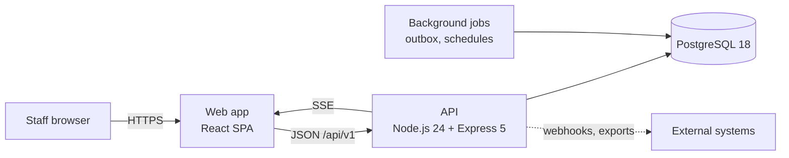
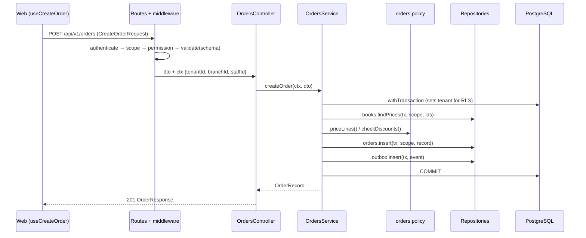

# Bookstore ERP v2: target architecture

Status: **accepted** by the owner on 2026-10-03 (issue #9); open for comments and updates
Owner: King2H · Last updated: 2026-10-03

This document describes how v2 is built. The *why* is in [`vision.md`](vision.md); individual
decisions and their trade-offs are recorded as ADRs in `docs/adr/` (#10). Where this document
and an accepted ADR disagree, the ADR wins and this document is updated.

---

## 1. System context



| Component | Technology | Notes |
|---|---|---|
| Web app | React 18, Vite, TanStack Query, react-hook-form + zod, Tailwind | Static files; talks only to the API |
| API | Node.js 24 LTS, Express 5, TypeScript (strict) | One deployable modular monolith |
| Data access | Kysely on `pg` | Type-safe SQL; no ORM |
| Database | PostgreSQL 18 | Migrations with `node-pg-migrate`; `numeric` money |
| Background work | Transactional outbox + scheduled jobs | In-process today; separate worker process later (#32) |
| Contracts | zod schemas in `packages/shared` | Drive validation, forms, types and OpenAPI |

### Deployment models (hybrid tenancy)

| | On-premise (first) | SaaS (later) |
|---|---|---|
| Customers per installation | One | Many |
| Tenants in the database | Exactly one | One per customer |
| Isolation | Separate installation + tenant scope | Tenant scope + PostgreSQL row-level security |
| Shipping unit | Docker image + compose bundle (#31) | The same image |

The code is **tenant-aware from the start**, so moving a customer from on-premise to SaaS is a
deployment change, not a code change.

---

## 2. Tiers

The system is organised in four tiers. Lower tiers are harder to change later, so they are
designed first.

| Tier | Concern | Contents | Epic |
|---|---|---|---|
| 1. Foundation | Data, trust, consistency | Data model and integrity, tenancy and scope, transactions, identity and access, API contracts | #3 |
| 2. Application spine | Layered code from client to database | Middleware, routes, controllers, services, domain, repositories; web app layers | #4 |
| 3. Productization | Fit for any customer | Configuration hierarchy, localization, registries, feature flags, integrations, onboarding | #5 |
| 4. Operations | Running and shipping | CI, images, observability, jobs, backups, releases | #6 |

---

## 3. Layers, from browser to database

Each layer calls **only the layer directly below it**.

| # | Layer | Responsibility | Must not |
|---|---|---|---|
| W1 | App shell / router | Routes, providers, auth and permission guards, layout | Contain business rules |
| W2 | Pages | Compose feature components for one screen | Call `fetch` or hold server data in `useState` |
| W3 | Feature components | Presentational UI for one domain | Know about HTTP |
| W4 | Forms | react-hook-form with the **shared** zod schema | Define their own validation rules |
| W5 | Server-state hooks | `useOrders()`, `useCreateOrder()`, query-key factories, targeted cache invalidation | Invalidate everything |
| W6 | API client (SDK) | Typed functions per endpoint, error normalization | Be called from anywhere except W5 |
| — | **Shared contracts** | Request/response zod schemas and types (`packages/shared`) | Depend on API or web code |
| A1 | Middleware | Request ID, logging, security headers, CORS, rate limit, authentication, **scope**, permissions, validation, error envelope | Contain business logic |
| A2 | Routes | URL + middleware chain → controller | Do anything else |
| A3 | Controller | Validated DTO → service call → response mapping | Contain business rules or SQL |
| A4 | Service | One function per use case; **owns the transaction**; orchestrates repositories and domain | Touch `req`/`res`; write SQL |
| A5 | Domain / policy | Pure functions: state machines, pricing, discounts, costing, allowed actions | Do I/O |
| A6 | Repository | All SQL (Kysely); maps rows ↔ records; requires scope parameters | Make business decisions |
| A7 | Database | Schema via migrations; constraints, indexes, row-level security | Be changed at runtime |

### Data shapes and where they live

| Shape | Purpose | Location |
|---|---|---|
| Request/response DTO | The API contract | `packages/shared/src/<domain>.ts` (zod) |
| Record | A database row in application form (camelCase, typed) | `modules/<domain>/<domain>.types.ts` |
| Domain rules | Behaviour over records | `modules/<domain>/<domain>.policy.ts` |
| Mapper | Row ↔ record ↔ DTO | `modules/<domain>/<domain>.mapper.ts` |

---

## 4. Backend module structure

Every API module has the same shape. Suppliers is the reference module (#19).

```
apps/api/src/
  db/
    pool.ts                    pg Pool
    kysely.ts                  Kysely instance + generated database types
    tx.ts                      withTransaction(ctx, fn), type Queryable
  middleware/                  cross-cutting (A1), incl. scope + validate(schema)
  modules/<domain>/
    <domain>.routes.ts         A2
    <domain>.controller.ts     A3
    <domain>.service.ts        A4
    <domain>.policy.ts         A5
    <domain>.repository.ts     A6
    <domain>.mapper.ts         row ↔ record ↔ DTO
    <domain>.types.ts          records
    __tests__/                 unit tests for policy and mapper
packages/shared/src/
  <domain>.ts                  zod request/response schemas + inferred types
  common.ts                    pagination, error envelope, money
```

### Example: create an order



---

## 5. Tenancy and scope

**Hierarchy:** tenant → branch → location. Every business row belongs to exactly one tenant;
branch-owned rows also carry a branch.

**Rules:**

1. **Scope comes from the authenticated context**, never from client input. A single scope
   middleware turns the access token into `ctx = { tenantId, branchId, staffId, permissions }`.
2. **Repositories require scope.** Every repository function for a tenant- or branch-owned
   table takes the scope as a parameter. A query without scope cannot be written.
3. **The database enforces it as well.** Row-level security policies on business tables
   check `current_setting('app.tenant_id')`, which the Unit of Work sets for every
   transaction. A missed filter in code still cannot leak another tenant's data.
4. **On-premise installs have exactly one tenant.** The same code and the same row-level
   security policies apply in every deployment (owner decision, 2026-10-03), so there is one
   code path to test and secure.

This replaces v1's per-endpoint filtering, which caused #12. Details: ADR on hybrid tenancy (#10, #13).

---

## 6. Transactions and consistency

- **Unit of Work:** `withTransaction(ctx, async (tx) => …)` opens one transaction, sets
  the tenant for row-level security, and passes `tx` to every repository involved. A sale that
  touches orders, inventory and receivables commits or rolls back as a whole (#14).
- **`Queryable`:** repositories accept either the pool or a transaction, so the same function
  works inside and outside a Unit of Work.
- **Transactional outbox:** events (notifications, webhooks) are written in the same
  transaction as the change and delivered afterwards by a poller.
- **Idempotency keys** on money-moving endpoints (kept from v1).
- **Concurrency:** optimistic locking (version column) for stock rows; `SELECT … FOR UPDATE`
  where a read-then-write must be atomic.
- **Money:** `numeric` in PostgreSQL and a single money helper in code. No floating-point
  arithmetic or equality checks on amounts (#18).

---

## 7. API contracts

- **One schema, three uses.** A zod schema in `packages/shared` validates requests in the
  API (`validate(schema)` middleware), drives web forms (`zodResolver`) and provides the
  TypeScript types on both sides.
- **Versioned URLs:** `/api/v1/...`. Breaking changes require a new version.
- **OpenAPI 3.1** is generated from the schemas and published with each release.
- **Error envelope:** every error response has the form
  `{ error: CODE, message, details, requestId, timestamp }`. Codes are stable and documented.

---

## 8. Identity and access

- **Authentication:** short-lived access token (JWT) plus an httpOnly refresh cookie, with
  rotation (v1 design kept).
- **Authorization:** permission-based (the union of a user's roles in the active branch),
  checked by middleware on every endpoint. Role names are never checked in business code.
- **Server-enforced account state:** "password change required" and deactivation are
  checked by the server on every request, not only in the browser (#38).
- **Secrets:** the API refuses to start with missing, invalid or placeholder secrets (#16).
- **Audit:** every write is recorded in the audit log with the acting staff member and scope.

---

## 9. Productization (configuration over customization)

| Mechanism | Examples | Issue |
|---|---|---|
| Configuration hierarchy: system → tenant → branch → user | Return window, discount limits, approval thresholds | #24 |
| Registries (data + small adapters) | Payment methods, document number series, notification channels | #25 |
| Localization | English and Amharic UI; ETB currency and formats; configurable tax (see below) | #26 |
| Feature flags / module licensing | Enable Bank Accounts or Installments per tenant | #27 |
| Integrations | Webhooks from the outbox, CSV/Excel import and export, accounting export | #28 |

### Tax (Ethiopian market)

- Tax is a **tenant setting**, editable by Super_Admin and Admin. The default is **off (0%)**.
- When enabled, the tenant defines its own tax rates (for example VAT or turnover tax),
  with tax-inclusive or tax-exclusive pricing. Rates are data with effective dates, never
  constants in code.
- Every sale stores the rate and amount that applied at the time, so reports stay correct
  after rates change.

---

## 10. Web app structure

```
apps/web/src/
  app/              router, providers, guards, layout
  features/<domain>/
    api.ts          typed endpoint functions (SDK)
    queries.ts      query-key factory + hooks
    components/     feature UI
    pages/          screens (composition only)
  shared/           design-system components, utilities
```

Navigation uses a router (URLs, back button, deep links). Permissions decide which routes and
actions are shown, and the server enforces them again.

**Framework versions:** at the start of the web work (#23), and before any feature is moved:
- upgrade to **React 19** and the current **Vite** major, together with matching Vitest and
  Testing Library versions, as a dedicated PR;
- adopt **React Router** for navigation.

Doing this before the feature-by-feature migration means every migrated feature is written
once, against the current versions.

---

## 11. Cross-cutting concerns

| Concern | Approach | Issue |
|---|---|---|
| Logging | Structured JSON (Pino) with request ID | #32 |
| Errors | `AppError` subclasses → error envelope; unexpected errors logged, generic 500 returned | — |
| Observability | Health and readiness endpoints, metrics, OpenTelemetry tracing | #32 |
| Background jobs | Scheduler with database locking, so only one instance runs each job | #32 |
| Testing | Unit tests for domain/policy; integration tests for repositories, services and HTTP; contract tests against OpenAPI; E2E with Playwright | #29, #30, #33 |

---

## 12. Environments and delivery

| Environment | Database | Runtime |
|---|---|---|
| Developer PC | PostgreSQL 18 in Docker (port 5433) | Node 24 natively (`docs/development.md`) |
| Claude Code on the web | PostgreSQL 18 via the session-start hook (port 5433) | Node 24 via the hook |
| CI | PostgreSQL 18 service container | Node 24 (#29) |
| On-premise / SaaS | PostgreSQL 18 | Multi-stage, non-root image `node:24-alpine`; migrations as a separate step (#31) |

**Branching and releases:** `main` is the v2 line; `release/1.x` maintains v1. Feature PRs
are squash-merged by the owner. Semantic Versioning; pre-release tags (`-alpha`, `-beta`,
`-rc`) only for builds handed outside development (ADR, #10).

---

## 13. Migration strategy (v1 → v2)

The refactor is incremental. At every step `main` works, and the HTTP-level test suite is
the safety net.

1. **Foundation first:** CI (#29), test isolation (#30), Unit of Work (#14), shared contracts
   (#15), Kysely (#18).
2. **Reference module:** Suppliers (#19) establishes the conventions.
3. **Proof of cross-module transactions:** Orders (#20).
4. **Remaining modules,** one PR each (#21), then the reports service split into read-model
   queries (#22).
5. **Tenancy** (#13) once repositories exist, because scope is enforced in the repository.
6. **Web app** in parallel, one feature at a time (#23).
7. **Productization and operations** (Tiers 3 and 4).

The detailed order and milestones are in `roadmap.md` (#11).

---

## 14. Decisions taken in this document (owner, 2026-10-03)

| Question | Decision |
|---|---|
| Target market | Ethiopia: ETB, English and Amharic. Tax configurable per tenant, default 0% (see §9). |
| Row-level security | Used in **all** deployments, on-premise included (§5). |
| React 19 and current Vite | Yes, as the first step of the web work (#23), before features are migrated (§10). |

These will also be recorded as ADRs (#10).
