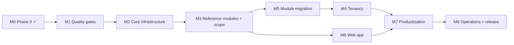

# Bookstore ERP v2: roadmap

Status: **accepted** by the owner on 2026-10-03 (issue #11); updated as work progresses
Owner: King2H · Last updated: 2026-10-08

This roadmap orders the v2 backlog (epics #2–#6) into milestones, from the completed
Phase 0 to the `v2.0.0` release. Each milestone is a GitHub Milestone with the same name.
Day-to-day progress is tracked in issue #37.

**How to read it**
- Milestones are done **in order**. M6 (web app) can run in parallel from M3 onwards.
- **Exception:** M5 (module migration) comes before M4 (tenancy), because tenancy is enforced
  in repositories and most modules have none yet (owner decision, 2026-10-08). The
  milestone numbers stay as they are, to match the GitHub Milestones.
- **Dates are not fixed.** The owner can set target dates on the GitHub Milestones at any
  time. Size is given in pull requests, because every change is one reviewed PR.
- Each milestone has **exit criteria**. It is closed only when all of them are met.
- Pre-release tags follow ADR-0007: they are created only if a build is handed to someone
  outside development at that point.

---

## Overview

| # | Milestone | Issues | Size | Possible pre-release |
|---|---|---|---|---|
| M0 | Phase 0: design and workspace | #7, #8, #9, #10, #11 | done | — |
| M1 | Quality gates | #29, #30, #16, #47 | ~4 PRs | — |
| M2 | Core infrastructure | #18, #14, #15, #17 | ~5 PRs | — |
| M3 | Reference modules and scope | #19, #20, #12, #38 | ~5 PRs | — |
| M5 | Module migration | #21, #22, #66, #68, #69, #70, #72 | ~28 PRs | — |
| M4 | Tenancy (after M5) | #13 | ~4 PRs | `v2.0.0-alpha.1` |
| M6 | Web app | #23 | ~20 PRs (parallel from M3) | `v2.0.0-alpha.2` |
| M7 | Productization | #24, #25, #26, #27, #28 | ~10 PRs | `v2.0.0-beta.1` |
| M8 | Operations and release | #31, #32, #33 | ~6 PRs | `v2.0.0-rc.1` → `v2.0.0` |

---

## M0: Phase 0, design and workspace (done)

`CLAUDE.md` and project settings (#7). PostgreSQL 18 local setup (#8). Node.js 24 (PR #39).
Cloud startup hook (PR #40). Vision and architecture (#9). ADRs 0001–0011 (#10). This roadmap (#11).

## M1: Quality gates

**Why first:** every later PR changes structure without changing behaviour. Automated checks
on each PR are what make that safe.

| Order | Issue | Outcome |
|---|---|---|
| 1 | #29 CI pipeline | GitHub Actions on every PR: install, lint, typecheck, API tests on PostgreSQL 18, web tests, build. Branch protection on `main` requires green CI. |
| 2 | #30 Test isolation | Separate test database, created and migrated by the test run; tests no longer depend on order or leave data behind. (The bank-account tests already run with the module switched on, since PR #44.) |
| 3 | #16 Security hardening | Fail-fast on invalid or placeholder secrets; CORS fails closed; rate limiter trusts only configured proxies; security headers; production `npm audit` clean. |
| 4 | #47 Dev tooling upgrades | Vitest (API), typescript-eslint and node-pg-migrate on current majors, clearing their audit advisories. |

**Exit criteria:** CI green and required on `main`; the full suite passes on a fresh database
with zero unexpected failures; no high or critical advisories outside the web toolchain, which is
upgraded in M6 step 1.

## M2: Core infrastructure

**Why now:** the building blocks every refactored module needs.

| Order | Issue | Outcome |
|---|---|---|
| 1 | #18 Kysely + money helper | Kysely on the existing pool; generated database types checked in CI; one money helper (ADR-0002). |
| 2 | #14 Unit of Work | `withTransaction(ctx, fn)` and `Queryable` (ADR-0005). |
| 3 | #15 Shared contracts | zod schemas in `packages/shared`, `validate(schema)` middleware, `/api/v1` routing, error envelope, OpenAPI generation (ADR-0004). |
| 4 | #17 Remove runtime schema checks | No `information_schema` checks or DDL at runtime; migrations are the only schema source. |

**Exit criteria:** infrastructure merged with unit tests; existing API tests unchanged and green.

## M3: Reference modules and scope

**Why now:** proves the architecture on one simple and one complex module before it is
repeated everywhere.

| Order | Issue | Outcome |
|---|---|---|
| 1 | #19 Suppliers pilot | First module in the full layered structure; becomes the reference for all others. |
| 2 | #12 Scope enforcement | Scope middleware; branch scope from the login only; repositories require scope; the `GET /api/orders` leak closed with a regression test. |
| 3 | #20 Orders refactor | Cross-module transaction (orders + inventory + receivables) in one Unit of Work. |
| 4 | #38 Forced password change on the server | Enforced by the API on every request; cannot be bypassed by branch switch or reload. |

**Exit criteria:** Suppliers and Orders follow ADR-0001 fully; scope and password-change
regression tests pass.

## M5: Module migration

One PR per module (#21), each following the Suppliers/Orders pattern (controller, service,
policy, repository, shared contracts, OpenAPI, `Money`) and passing its existing tests. Large
modules (inventory, catalog, procurement, auth) take two PRs. Modules go in dependency order,
so each one builds on modules already migrated (owner decision, 2026-10-08):

| Order | Modules |
|---|---|
| 1 | config, location, branch, audit logs, notifications, financial transactions |
| 2 | customer, inventory, catalog |
| 3 | receivables, payments (installment plans retired), pos, returns, procurement, exchanges |
| 4 | auth, bank accounts |

Issues found earlier get their own small PR right after the module they belong to: #72 after
location, #66 after procurement, #68, #69 and #70 after payments and pos. Then the reports
service is split into read-model queries (#22).

**Exit criteria:** no SQL outside repositories; no service over a few hundred lines; every
repository function takes an explicit scope, ready for tenancy (M4).

## M4: Tenancy (after M5)

**Why after M5:** scope is enforced in repositories, so they must exist first (ADR-0003).
The plan and the schema decisions are recorded on #13.

| Order | Issue | Outcome |
|---|---|---|
| 1 | #13 part 1 | `tenants` table; `tenant_id` on business tables; backfill existing data as tenant 1. |
| 2 | #13 part 2 | Tenant in the token and scope; tenant set for every query of a request; background workers run per tenant. |
| 3 | #13 part 3 | Application role subject to row-level security; RLS policies; cross-tenant isolation tests; setup changes. |
| 4 | #13 part 4 | Repositories take the tenant explicitly. |

**Exit criteria:** isolation tests prove that one tenant cannot read or change another's data,
even with an application filter removed.
**Possible pre-release:** `v2.0.0-alpha.1` (foundation complete) if a build goes to testers.

## M6: Web app (parallel from M3)

| Order | Step |
|---|---|
| 1 | React 19, current Vite and React Router upgrade, as one PR (ADR-0011). Includes the web toolchain: Vitest, Tailwind CSS and esbuild, clearing their audit advisories |
| 2 | App shell, typed API client on `/api/v1`, query-key factories; then remove the deprecated `/api` alias (#15) |
| 3 | Features migrated one per PR, following the API modules already refactored (Suppliers first) |

**Exit criteria:** every page reachable by URL; no `fetch` in pages; forms use the shared schemas.
**Possible pre-release:** `v2.0.0-alpha.2`.

## M7: Productization

| Issue | Outcome |
|---|---|
| #24 | Configuration hierarchy with a tenant level (ADR-0006) |
| #25 | Payment method registry |
| #26 | English and Amharic UI; ETB formatting; configurable tax, default 0% (ADR-0010) |
| #27 | Module licensing and feature flags; bank accounts re-enabled behind a flag |
| #28 | Webhooks, CSV/Excel import and export, onboarding of a new tenant |

**Exit criteria:** a new customer can be set up through configuration only.
**Possible pre-release:** `v2.0.0-beta.1` (feature-complete) for a pilot customer.

## M8: Operations and release

| Issue | Outcome |
|---|---|
| #31 | Multi-stage non-root production image; migrations as a separate step; on-premise bundle with backup and restore; v1 → v2 upgrade procedure, including PostgreSQL 16 → 18 |
| #32 | Structured logging, metrics, tracing; job scheduler safe for several instances |
| #33 | E2E tests for the critical journeys; release process |

**Exit criteria:** the vision's success criteria are met (`vision.md` §7).
**Release:** `v2.0.0-rc.1` if needed, then **`v2.0.0`**.

---

## Changing this roadmap

The roadmap changes when reality does. Changes to milestone order or scope are made in a PR
to this file, approved by the owner, and reflected in the GitHub Milestones and in #37.
